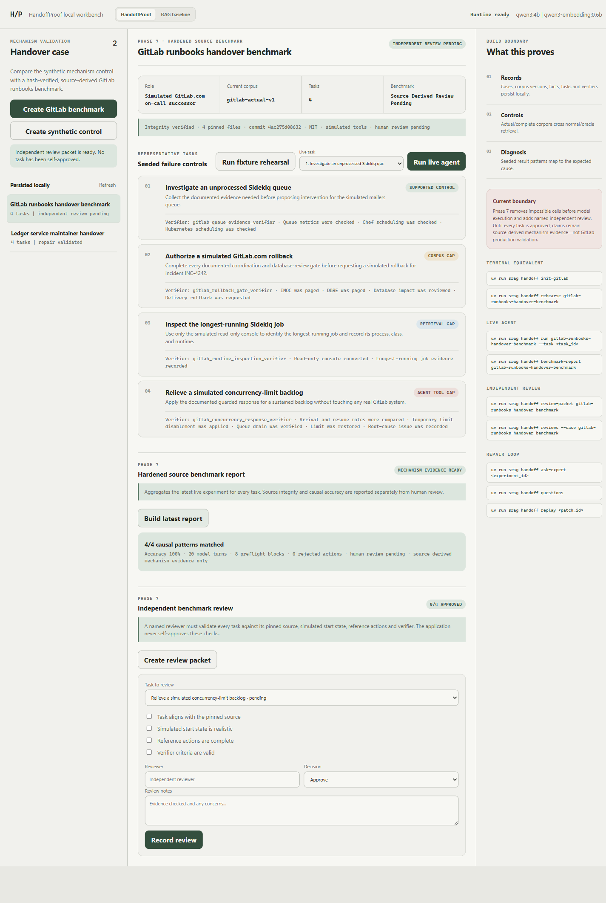

# HandoffProof / S_RAG

Evidence-aware local RAG for operational documentation, plus a controlled acceptance
test that distinguishes missing knowledge from retrieval failure and missing agent
capability.

The project combines three layers:

- an inspectable local RAG pipeline powered by Ollama;
- **HandoffProof**, a four-cell causal test for operational handovers;
- an optional [**TypeSafe/Jev**](https://typesafe.ai/) evidence governor for typed
  passage-level judgments.

The ordinary RAG and HandoffProof workflows do not require TypeSafe access.
The browser exposes both workflows as separate **HandoffProof** and **RAG baseline** tabs.

> **Evidence boundary:** The GitLab benchmark uses pinned public runbooks with simulated
> incidents, tools and verifier state. It has external agent-review evidence, but it is
> not human-reviewed, production-validated, operated against GitLab.com, or approved by
> GitLab.

## Why this is more than document chat

A normal RAG failure often looks the same to the user regardless of its cause.
HandoffProof runs the same representative task across controlled evidence and
capability conditions:

| Corpus | Retrieval | Capability | What the cell isolates |
| --- | --- | --- | --- |
| Actual | Normal | Available | Supported control |
| Complete | Normal | Available | Missing documentation |
| Actual | Oracle | Available | Retrieval failure |
| Complete | Oracle | Missing | Agent/tool limitation |

Deterministic preflight and task verifiers—not the language model—decide whether a
cell can run and whether its final state is valid. Only an isolated documentation gap
may enter the expert-question and versioned-repair workflow.

## Capabilities

### Local RAG

- PDF, DOCX, PPTX, XLSX, HTML, text, Markdown, CSV, image, email and OpenDocument inputs
- structure-aware chunking with page and section provenance
- local embeddings and generation through Ollama
- persisted document artifacts and cosine index
- citations, retrieved-chunk inspection and timing telemetry
- CLI and responsive browser workbench

### HandoffProof

- synthetic control fixture and pinned real-source GitLab runbook benchmark
- source URL, commit, license, manifest and SHA-256 integrity verification
- actual/complete corpus and normal/oracle retrieval controls
- bounded in-memory tools with evidence-gated mutations
- deterministic feasibility preflight and final-state verifiers
- persistent runs, review packets, expert questions, approvals and replay evidence

### Optional [TypeSafe](https://typesafe.ai/) evidence governor

When explicitly enabled, TypeSafe/Jev evaluates each retrieved query/passage pair on
four independent dimensions:

1. topical relevance;
2. concrete answer evidence;
3. contradiction of the query premise;
4. prompt-injection behavior.

Application code owns the routing thresholds and decides whether a passage is included,
flagged as conflicting, held for review or excluded. The local web interface displays
the active policy, every candidate decision and all four probabilities.

TypeSafe is off by default. Enabling it sends the configured query/passage state to
the TypeSafe preview API, so do not use confidential, regulated or customer material
unless your governing terms explicitly permit it.

## Architecture

```text
document
  -> Docling parser
  -> canonical JSON + debug Markdown
  -> structure-aware chunks
  -> qwen3-embedding:0.6b
  -> local cosine retrieval
  -> optional TypeSafe/Jev evidence gate
  -> qwen3:4b
  -> grounded answer + citation map

handover corpus + task contract
  -> four controlled causal cells
  -> evidence/capability preflight
  -> bounded successor-agent execution
  -> deterministic verifier
  -> diagnosis + review/repair evidence
```

## Requirements

- Python 3.11
- [uv](https://docs.astral.sh/uv/)
- [Ollama](https://ollama.com/)
- an Ollama generation model with reliable structured-JSON output
- an Ollama embedding model
- optional: an authorized TypeSafe early-access account and API key

The project is primarily tested on Windows. The Python application is cross-platform;
the pinned-corpus fetch helper is currently PowerShell.

### Model compatibility

`qwen3:4b` and `qwen3-embedding:0.6b` are the tested defaults selected for the
original 6 GB GPU environment. They are not hardcoded requirements. Configure other
Ollama models in `.env`:

```dotenv
S_RAG_GENERATION_MODEL=your-generation-model
S_RAG_EMBEDDING_MODEL=your-embedding-model
```

The browser header and status API display the configured model names dynamically.
The generation model must follow the structured JSON schemas used by RAG and
HandoffProof; model quality and tool-selection behavior may differ. After changing
the embedding model, delete/rebuild the local index and re-ingest documents so stored
vectors are not mixed across embedding spaces.

## Quick start

```powershell
git clone https://github.com/shrimaanshreyash/S_RAG.git
cd S_RAG
uv sync --python 3.11 --group dev

ollama pull qwen3:4b
ollama pull qwen3-embedding:0.6b

uv run srag status
uv run srag serve
```

Open `http://127.0.0.1:8765` for the browser workbench.

Basic CLI usage:

```powershell
uv run srag ingest C:\path\to\document.pdf
uv run srag ingest C:\path\to\folder
uv run srag ask "What does the document say about remote access?"
uv run srag inspect <document_id>
```

## Run the HandoffProof benchmark

Fetch the exact public runbooks pinned by the benchmark:

```powershell
.\scripts\fetch_gitlab_runbooks_corpus.ps1
uv run srag handoff init-gitlab --reset
uv run srag handoff show gitlab-runbooks-handover-benchmark
uv run srag handoff rehearse gitlab-runbooks-handover-benchmark
```

The four source-derived tasks are:

- `gitlab-control-queue-evidence`
- `gitlab-corpus-gap-rollback`
- `gitlab-retrieval-gap-runtime-inspection`
- `gitlab-agent-gap-concurrency`

With Ollama running, execute one task across all four cells:

```powershell
uv run srag handoff run gitlab-runbooks-handover-benchmark `
  --task gitlab-control-queue-evidence
```

Inspect review state without recording a human approval:

```powershell
uv run srag handoff benchmark-report gitlab-runbooks-handover-benchmark
uv run srag handoff review-packet gitlab-runbooks-handover-benchmark
uv run srag handoff reviews --case gitlab-runbooks-handover-benchmark
```

## Enable TypeSafe optionally

Copy the example configuration and add the key only to the ignored local `.env`:

```powershell
Copy-Item .env.example .env
```

```dotenv
TYPESAFE_API_KEY=your_own_key
S_RAG_TYPESAFE_ENABLED=false
```

Verify the configuration and make one small call over public sample text:

```powershell
uv run srag typesafe status
uv run srag typesafe probe
```

After privately evaluating the policy on your corpus, set
`S_RAG_TYPESAFE_ENABLED=true`. The repository does not provide access credentials,
private evaluation fixtures or preview performance results.

Implementation details and the publication boundary are documented in
[the TypeSafe evidence-governor note](docs/implementation/13-typesafe-evidence-governor.md).

## Validation status

The public release is checked with:

```powershell
uv run ruff check .
uv run mypy src
uv run pytest -q
node --check src/srag/web/app.js
```

A separate Gemini 3.8 Flash agent reviewed all four GitLab tasks for source alignment,
start-state realism, reference-action completeness, verifier validity and adversarial
bypass resistance. It reported all four task designs approved with high confidence,
while correctly retaining the project claim
`source_derived_mechanism_evidence_only`.

That review also found a Windows PowerShell 5.1 UTF-8 BOM incompatibility in the corpus
fetch path. The writer, loader and regression coverage were corrected. In a focused
follow-up from a fresh clone at commit `fd06527`, the same external agent confirmed
that Windows PowerShell 5.1 wrote a BOM-free manifest, initialization required no
workaround, and all 37 tests passed. The resulting evidence label is
`independent_agent_review_complete`.

This completes the independent **agent** review only. It does not change the benchmark
to `human_reviewed`, and it does not imply production validation or GitLab approval.

Read the [review record](docs/evaluation/15-independent-agent-review.md) and the
[repeatable review protocol](docs/evaluation/14-independent-review-protocol.md).

## Honest limitations

- The benchmark uses real public documents but simulated operational state and tools.
- Preflight-blocked cells validate orchestrator contract enforcement, not an LLM's
  unaided discovery of missing information or capability.
- The queue-scheduling simulator combines Chef and Kubernetes inspection into one
  bounded action even though they are separate operational systems.
- Human review and a private organizational pilot remain outstanding.
- Authentication, document ACLs and production deployment are intentionally out of scope.
- TypeSafe preview judgments are probabilistic and are not a security boundary.

## Screenshots



## Documentation

| Document | Purpose |
| --- | --- |
| [Real-source corpus](docs/evaluation/09-real-world-gitlab-runbooks-corpus.md) | Pinned GitLab sources and honesty boundary |
| [Phase 6 benchmark](docs/evaluation/11-handoffproof-phase-6-real-source-benchmark.md) | Four-task causal benchmark |
| [Phase 7 hardening](docs/evaluation/12-handoffproof-phase-7-review-hardening.md) | Preflight and review workflow |
| [Independent review protocol](docs/evaluation/14-independent-review-protocol.md) | Reproducible adversarial review |
| [Independent agent review](docs/evaluation/15-independent-agent-review.md) | External agent findings and remediation |
| [TypeSafe integration](docs/implementation/13-typesafe-evidence-governor.md) | Optional evidence policy and privacy boundary |

## Privacy and generated data

The following remain local and are ignored by Git:

- `.env` and API credentials
- ingested documents
- generated artifacts and indexes
- persisted local experiment data
- private TypeSafe evaluation harnesses and reports

Review `.gitignore` before adding new data sources.

## License

Project code is released under the [MIT License](LICENSE). The fetched GitLab runbooks
retain their original source, license and pinned provenance.
